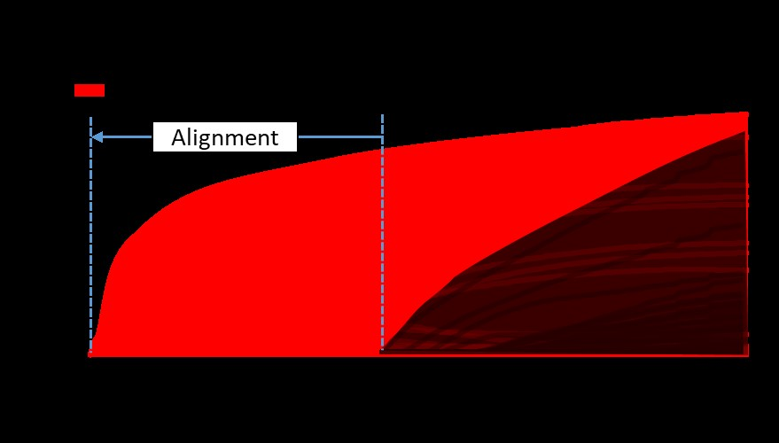

# MTLComb: multi-task learning combing regression and classification tasks with joint feature selection


## Introduction
Multi-task learning (MTL) is a learning paradigm that enables the simultaneous training of multiple communicating algorithms. Although MTL has been successfully applied to ether regression or classification tasks alone, incorporating mixed types of tasks into a unified MTL framework remains challenging, primarily due to variations in the magnitudes of losses associated with different tasks. This challenge, particularly evident in MTL applications with joint feature selection, often results in biased selections. To overcome this obstacle, we propose a provable loss weighting scheme that analytically determines the optimal weights for balancing regression and classification tasks. This scheme significantly mitigates the otherwise biased feature selection. Building upon this scheme, we introduce MTLComb, an MTL algorithm and software package encompassing optimization procedures, training protocols, and hyperparameter estimation procedures. MTLComb is designed for learning shared predictors among tasks of mixed types. To showcase the efficacy of MTLComb, we conduct tests on both simulated data and biomedical studies pertaining to sepsis and schizophrenia.

<p align="center"> 
​
</p>

## Installation

```r
install.packages("devtools")
library("devtools")
install_github("transbioZI/MTLComb")
```


## Tutorial
The [Tutorial](https://github.com/transbioZI/MTLComb/blob/main/tests/MTLComb_Tutorial.R) demonstrated all functions of MTLComb regarding to solver, training procedure, cross-validation and prediction procedure.
This [script](https://github.com/transbioZI/MTLComb/blob/main/tests/MTLComb_codes4paper.R) demonstrate the codes for generating the results of MTLComb paper.


## Contact

Han Cao (hank9cao@gmail.com)
